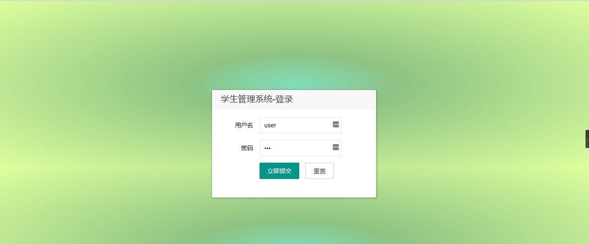
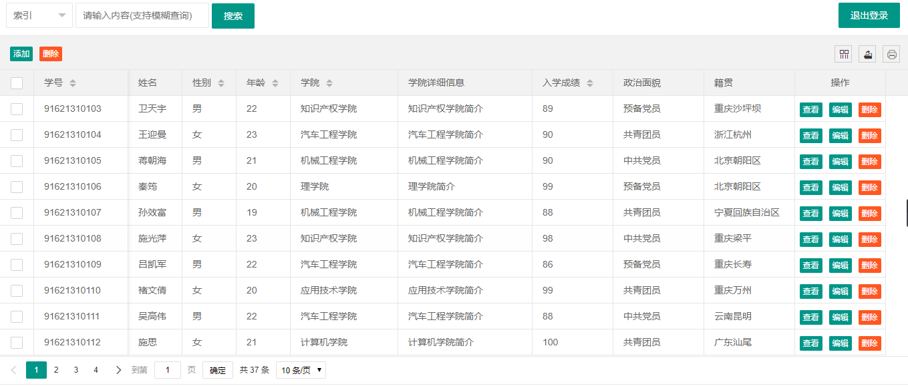

***
#### 学生管理系统-Crud
***
* 系统简介  
    >后端使用Servlet开发，数据交互使用json格式，前端主要使用Layui开发UI界面，使用ajax实现数据传输和交互。  
    
    >系统实现了登录，登录验证，数据显示，分页显示，查找，模糊查找，删除，批量删除等功能。具体可以查看项目演示或者跑起来试试。
***
* 系统演示
    >登录
      
    
    >主页
    